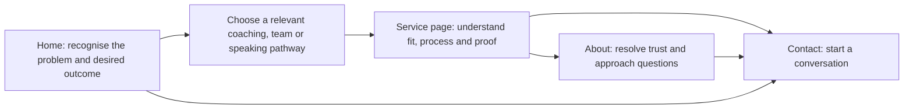

# Threads Coaching Astro Migration: Definitive Implementation Plan

Prepared 15 August 2026.

This specification is the implementation handoff. It records the architectural, content, SEO, design, migration, deployment, and QA decisions needed to replace the Wix website without repeating the audit or redesigning the solution.

The local workspace was empty and was not a Git repository at the time of this audit. The only local implementation artifact inspected was the standalone mock homepage at `/Users/brynjoslin/Downloads/threads-coaching.html`.

---

## 1. Executive summary

### Destination

Build a small, predominantly static Astro website that:

- Is stored in a private GitHub repository.
- Is deployed through Cloudflare Pages.
- Uses HTML, CSS, and almost no client-side JavaScript.
- Preserves valuable existing content and URL equity.
- Uses the mock homepage as the visual and StoryBrand direction.
- Is accessible to WCAG 2.2 AA where reasonably achievable.
- Makes the visitor the hero and Threads Coaching the trusted guide.
- Has one clear conversion route: service discovery -> trust -> contact.
- Defaults safely to `noindex` outside production.
- Requires no CMS, database, UI framework, analytics SDK, or paid form service.

### Decisions that must not be reopened during implementation

| Area | Decision |
|---|---|
| Canonical origin | `https://www.threadscoaching.co.uk` |
| URL style | Lowercase, extensionless, no trailing slash |
| Rendering | Astro static output |
| Cloudflare adapter | None; static Astro does not need one |
| Dynamic code | One narrowly routed Pages Function for 410 responses; a form Function comes later |
| Package manager | npm with committed lockfile |
| JavaScript | Only the enquiry-form enhancement; native HTML for navigation and disclosure widgets |
| CMS | None |
| Fonts | System font stack; no external font service |
| Analytics at launch | None; use Search Console and Cloudflare request data |
| Primary CTA | “Start a conversation” -> `/contact` |
| Transitional CTA | “Explore coaching options” -> `/one-to-one-sessions` |
| Main navigation | Coaching, Teams, Speaking, About, Start a conversation |
| Production environment switch | One variable: `SITE_ENV=production`; all other builds default to preview |
| Structured data | Organization, Person, WebSite, Service, BreadcrumbList, AboutPage and ContactPage where applicable |
| LocalBusiness schema | Do not use without a verified public address or eligible service-area profile |
| FAQ schema | Do not emit initially; keep FAQs visible as semantic HTML |
| Removed content | `/feed` and `/events-page` return 410 |
| Key redirects | `/my-approach` and `/more-about-me` -> `/about`; `/s-projects-side-by-side` -> `/body-soul-spirit-reset` |
| Form phase one | Honest non-sending placeholder UI plus working email and telephone alternatives |
| Image hosting | Download authorised selected assets, commit them locally, and remove Wix runtime dependencies |
| Branching | Protected `main`, short-lived branches, pull requests, squash merge |
| Production branch | `main` |
| Wix cancellation | Not until the new site has been stable for at least 14 days |

### Factual approval gates

These are content approvals, not unresolved architectural decisions. Use the specified default if an answer is unavailable:

- “700+ hours of coaching”: retain only after confirmation; otherwise omit the number.
- Public-speaking audiences “from small groups to thousands”: retain only after confirmation.
- Paul’s training status: state only the latest owner-approved wording.
- Working Genius terminology and any accreditation: preserve the existing conservative wording; do not claim certification.
- Geographic positioning: default to online/UK wording; do not target “Lincoln coach” unless the owners confirm it.
- Body Soul Spirit Reset PDF: use a direct local download if supplied; otherwise use an honest contact CTA and make no automatic-delivery promise.
- Social profiles: publish only profiles confirmed as active.
- Privacy notice: prepare the specified factual draft, but obtain owner approval before production.

---

## 2. Existing-site audit

### Site hierarchy

The current [sitemap](https://www.threadscoaching.co.uk/sitemap.xml) is a Wix sitemap index containing a pages sitemap and an empty member-profile sitemap. The pages sitemap contains 11 URLs:

- Homepage
- Our Approach
- Body Soul Spirit Reset
- One-to-One Sessions
- Personality – Discover & Develop
- Team Workshops
- Public Speaking
- Contact
- More About Me
- Feed
- Events Page

The visible navigation links only to the homepage, five primary service/about pages, and contact. No meaningful internally linked page was found outside the sitemap. Searches and page inspection found no published blog posts or publicly exposed PDF download.

### Current technical and SEO condition

The live site has useful content but a weak technical foundation:

- The homepage title is `Threads Coaching | leadership development`.
- Several pages have no meta description.
- Homepage and other prominent headings include blank or zero-width H1 elements.
- Heading hierarchy is inconsistent; some pages have multiple H1s and others have none.
- Homepage structured data is limited to basic WebSite information.
- Open Graph implementation is incomplete and has no dependable social image.
- The visible contact email is correct, but its homepage link points to the Wix placeholder `info@mysite.com`.
- The footer still says `© 2035 by Personal Life Coach. Powered and secured by Wix`.
- Numerous images have empty or weak alternative text.
- At a narrow mobile viewport the document remains approximately 980 pixels wide, producing clipping and horizontal scrolling.
- Content and decorative images remain tied to Wix-hosted URLs.
- The homepage foregrounds the business and its credentials more than the visitor’s immediate problem and desired outcome.
- The site contains untouched Wix template content, an empty feed, and an empty events page.

The current apex host redirects to `www`, so retaining `www` avoids an unnecessary canonical-host migration.

### Page-quality findings

- [Homepage](https://www.threadscoaching.co.uk/): authentic warmth, useful biographies and testimonials, but vague positioning, poor heading semantics, weak mobile layout, and an unreliable CTA/contact implementation.
- [Our Approach](https://www.threadscoaching.co.uk/my-approach): valuable explanations of Joy and Paul’s approaches and experience; should become the substantive core of `/about`.
- [One-to-One Sessions](https://www.threadscoaching.co.uk/one-to-one-sessions): valuable service content concerning purpose, calling, confidence, values, spiritual direction, and solution-focused coaching.
- [Personality – Discover & Develop](https://www.threadscoaching.co.uk/personality-discover-develop): a distinct offering with useful long-tail search potential and an existing testimonial.
- [Team Workshops](https://www.threadscoaching.co.uk/team-workshops): three credible organizational offers with significant content worth preserving.
- [Body Soul Spirit Reset](https://www.threadscoaching.co.uk/s-projects-side-by-side): meaningful specialist content hidden behind a poor Wix path.
- [Public Speaking](https://www.threadscoaching.co.uk/public-speaking): credible speaking and preaching proposition that needs a clearer organizer-focused structure.
- [Contact](https://www.threadscoaching.co.uk/contact): useful phone, email, and basic fields, but no proper H1, privacy context, or dependable form implementation.
- [More About Me](https://www.threadscoaching.co.uk/more-about-me): untouched Wix template filler; preserve none of its body copy.
- [Feed](https://www.threadscoaching.co.uk/feed): empty.
- [Events Page](https://www.threadscoaching.co.uk/events-page): empty.

---

## 3. Existing messaging and StoryBrand analysis

### Current character

The existing copy serves several overlapping audiences:

- Individuals navigating leadership, calling, identity, faith, confidence, or change.
- Christian clients wanting faith-aware coaching.
- People wanting personality-led self-understanding and development.
- Teams in churches, charities, health, social care, pastoral work, public service, or the third sector.
- Event, conference, church, podcast, and panel organizers.

The central desire is not simply “coaching.” It is greater clarity, confidence, alignment, and the ability to make constructive change.

### Current problem

External problems include:

- Uncertainty about the next step.
- Leadership or organizational pressure.
- Values that are not reflected in daily behaviour.
- A lack of confidence, direction, or self-understanding.
- Disconnection between body, emotions, faith, and practical decisions.

Internal tensions include feeling stuck, overwhelmed, divided, or unsure whether one is using one’s gifts well.

The philosophical issue is that people should not have to navigate meaningful change alone or become someone inauthentic to move forward.

### Threads Coaching as guide

Retain:

- The warm husband-and-wife partnership.
- Joy’s coaching and leadership experience.
- Paul’s pastoral, teaching, and faith-aware perspective.
- Experience across church, public, and third-sector settings.
- The non-formulaic, whole-person approach.
- Existing testimonials.
- The tapestry/thread metaphor in limited form where it supports the brand.

Reposition:

- Credentials should follow an expression of empathy and explain why the visitor can trust the process.
- Long biographies belong on `/about`, not above the homepage service pathways.
- Faith should be clear where relevant without implying every service requires a particular religious position.
- Personal stories should demonstrate understanding, not make the company the main character.

Remove or rewrite:

- “Empowering people to ignite change” is too broad to perform as the main proposition.
- Repeated claims about Threads Coaching should become visitor outcomes.
- Generic phrases such as “unlock your potential” should be replaced by concrete results.
- Template filler and empty pages must disappear.

### Plan and calls to action

The shared three-step plan is:

1. Tell us where you are.
2. Choose the support that fits.
3. Move forward with greater clarity.

The direct CTA is “Start a conversation.” It accurately reflects the current absence of a booking system.

Contextual CTAs may be more specific:

- “Talk to us about your team”
- “Enquire about speaking”
- “Ask about personality coaching”
- “Explore one-to-one coaching”

### Success and stakes

Success should be expressed as:

- A clearer next step.
- Decisions aligned with values and calling.
- Greater confidence without pretence.
- Healthier team relationships and shared ways of working.
- Faith, identity, and practical action becoming more integrated.

Stakes should remain gentle:

- Continuing alone can prolong uncertainty.
- Unexamined patterns can keep a person or team circling the same problem.
- Values that remain only words do not shape culture.

Do not use artificial urgency, countdowns, scarcity, or fear-based copy.

---

## 4. Existing URL inventory

| Current URL and title | Purpose and content | Search intent and SEO value | Preserve/duplication |
|---|---|---|---|
| `/` — `Threads Coaching | leadership development` | Business overview, Joy and Paul, services, testimonials, contact | Brand, life/leadership/Christian coaching; highest authority page | Preserve positioning facts, biographies, testimonials and contact data; rewrite structure |
| `/more-about-me` — `More About Me | Threads Coaching` | Wix template “about” page | Negligible; thin/template content | Preserve nothing; duplicates the role of a future About page |
| `/feed` — `Feed | Threads Coaching` | Empty Wix blog feed | No meaningful value | Preserve nothing |
| `/contact` — `Contact | Threads Coaching` | Phone, email, Wix contact form | Brand/contact intent | Preserve URL and contact options; replace form and copy |
| `/s-projects-side-by-side` — `Body Soul Spirit Reset | Threads Coaching` | Whole-person, faith-aware coaching and free-resource proposition | Specialist long-tail potential | Preserve core proposition and Paul’s relevant lived-experience framing |
| `/events-page` — `Events Page | Threads Coaching` | Empty page | No meaningful value | Preserve nothing |
| `/public-speaking` — `Public Speaking | Threads Coaching` | Joy’s speaking, preaching, podcast, panel and conference work | Speaker/church/event-organizer intent | Preserve factual formats, themes and scale only after verification |
| `/team-workshops` — `Team workshops | Threads Coaching` | Reflective-practice coaching, Working Genius and organizational values | Strong service and organizational search intent | Preserve all three service propositions |
| `/my-approach` — `Our Approach | Threads Coaching` | Separate explanations of Joy and Paul’s approach and experience | Trust and coach-comparison intent | Move substantive content to `/about`; overlaps homepage biographies |
| `/one-to-one-sessions` — `One - to - One Sessions | Threads Coaching` | Joy-focused individual coaching, purpose, calling, values and spiritual direction | Strong commercial/service intent | Preserve URL and substantive topics; extend carefully to explain both coaches |
| `/personality-discover-develop` — `Personality - Discover & Develop | Threads Coaching` | One-off personality session and five-session development pathway | Distinct service and long-tail intent | Preserve URL, two-stage offer and testimonial |

Operational Wix URLs:

| URL | Current role | New outcome |
|---|---|---|
| `/sitemap.xml` | Sitemap index | Replace with one canonical XML sitemap at the same URL |
| `/pages-sitemap.xml` | Wix child sitemap | 410 |
| `/member-profile_p_first-chunk-sitemap.xml` | Empty Wix member sitemap | 410 |

All listed URLs returned HTTP 200 at the time of the audit, including the empty/template pages.

---

## 5. URL migration matrix

| Old URL | New URL | Action | Reason and content treatment | SEO notes |
|---|---|---|---|---|
| `/` | `/` | Keep | Rewrite homepage using mock direction; retain authentic facts and testimonials | Preserve primary authority and backlinks |
| `/more-about-me` | `/about` | Consolidate + 301 | Template body removed; `/about` satisfies genuine about intent | Relevant destination; no homepage redirect |
| `/feed` | None | Remove + 410 | Empty feed with no posts or equivalent | Signals intentional permanent removal |
| `/contact` | `/contact` | Keep | Replace page and form UI | Preserve contact/brand intent |
| `/s-projects-side-by-side` | `/body-soul-spirit-reset` | Move + 301 | Preserve specialist content under a descriptive path | Stronger usability without losing accumulated signals |
| `/events-page` | None | Remove + 410 | Empty page with no replacement | Do not redirect irrelevant traffic |
| `/public-speaking` | `/public-speaking` | Keep | Rewrite as organizer-focused landing page | Preserve service URL |
| `/team-workshops` | `/team-workshops` | Keep | Rewrite while retaining all three offers | Preserve strong service content |
| `/my-approach` | `/about` | Move + 301 | Approach and biographies become one guide/authority page | Relevant consolidation |
| `/one-to-one-sessions` | `/one-to-one-sessions` | Keep | Retain intent; improve structure | Preserve service equity |
| `/personality-discover-develop` | `/personality-discover-develop` | Keep | Retain distinctive service and wording | Preserve long-tail potential |
| `/sitemap.xml` | `/sitemap.xml` | Keep | Replace Wix index with canonical custom sitemap | Update Search Console submission |
| `/pages-sitemap.xml` | None | Remove + 410 | Obsolete Wix infrastructure | Remove from new sitemap |
| `/member-profile_p_first-chunk-sitemap.xml` | None | Remove + 410 | Empty obsolete Wix infrastructure | No redirect |

### Machine-friendly definitive mapping

```yaml
canonical_origin: https://www.threadscoaching.co.uk
trailing_slash: never

keep:
  - /
  - /contact
  - /public-speaking
  - /team-workshops
  - /one-to-one-sessions
  - /personality-discover-develop
  - /sitemap.xml

redirects:
  - from: /more-about-me
    to: /about
    status: 301
  - from: /my-approach
    to: /about
    status: 301
  - from: /s-projects-side-by-side
    to: /body-soul-spirit-reset
    status: 301

gone:
  - /feed
  - /events-page
  - /pages-sitemap.xml
  - /member-profile_p_first-chunk-sitemap.xml
```

Create explicit slash-variant rules for every redirect and every canonical new page. Do not introduce chains, regular-expression catch-alls, or homepage fallbacks. Google recommends direct permanent server redirects and warns that irrelevant destinations can be treated as soft 404s. [Google redirect guidance](https://developers.google.com/search/docs/crawling-indexing/301-redirects)

---

## 6. Proposed information architecture

### Public pages

| URL | Page |
|---|---|
| `/` | Homepage |
| `/one-to-one-sessions` | One-to-one coaching |
| `/personality-discover-develop` | Personality coaching |
| `/team-workshops` | Teams and workshops |
| `/body-soul-spirit-reset` | Body Soul Spirit Reset |
| `/public-speaking` | Speaking and preaching |
| `/about` | About Joy, Paul and their approach |
| `/contact` | Contact/start a conversation |
| `/privacy` | Privacy notice |
| `/404` | Generated 404 document, not a navigable sitemap URL |

### Navigation

Header:

- Coaching -> `/one-to-one-sessions`
- Teams -> `/team-workshops`
- Speaking -> `/public-speaking`
- About -> `/about`
- Start a conversation -> `/contact`

Footer:

- All header links.
- Personality coaching.
- Body Soul Spirit Reset.
- Privacy.
- Confirmed social profiles.
- Email and telephone links.

Do not hide service discovery inside a JavaScript-only dropdown. The coaching hub links prominently to the personality and Body Soul Spirit Reset pathways.

### Conversion journey



---

## 7. StoryBrand and conversion strategy

Each major page has one conversion responsibility:

- Homepage: orient and help the visitor self-select.
- One-to-one page: explain the main individual coaching route.
- Personality page: convert specific personality-development intent.
- Team page: convert organizational buyers and team leaders.
- Body Soul Spirit Reset: speak sensitively to people seeking whole-person, faith-aware support.
- Speaking page: give organizers enough information to enquire.
- About: establish empathy, credibility, fit, and the difference between Joy and Paul.
- Contact: reduce friction and set honest expectations.

Testimonials should appear where they address a real objection, not as a disconnected carousel. Use static blockquotes; no autoplay, slider library, or client-side carousel.

Faith-aware positioning should be explicit on relevant pages but should not obscure the practical outcomes or imply unsupported therapeutic or medical services.

---

## 8. Homepage specification

### Core proposition

H1:

> Find clarity. Grow with courage. Bring change to your world.

Supporting copy must immediately identify the offer and audience:

> Life, leadership and Christian coaching for individuals and teams who want a clearer way forward.

Primary CTA: “Start a conversation”
Secondary CTA: “Explore coaching options”

### Section order

1. **Hero**
   - Clear category, audience, outcome, CTA, and Joy/Paul photograph.
   - Do not lead with a biography.
   - Keep the mock’s clarity and warmth.

2. **Recognition: who this is for**
   - Three or four concise situations: carrying leadership responsibility, navigating change, feeling stuck, or wanting values and faith to shape action.
   - Use visitor-centred language.

3. **Empathy and desired transformation**
   - Acknowledge that clarity is difficult when identity, pressure, relationships, faith, and practical choices overlap.
   - Contrast circling the problem with taking an aligned next step.

4. **Choose a pathway**
   - One-to-one coaching.
   - Personality coaching.
   - Team workshops.
   - Body Soul Spirit Reset.
   - Speaking and preaching.
   - Each card has a specific text link, not “Learn more.”

5. **Simple plan**
   - Tell us where you are.
   - Choose the support that fits.
   - Move forward with greater clarity.

6. **Guide and authority**
   - Short Joy and Paul introductions.
   - Explain the benefit of their distinct backgrounds.
   - Use verified qualifications and experience.
   - Link to `/about`.

7. **Team/organization emphasis**
   - Briefly distinguish individual and organizational support.
   - Link to `/team-workshops`.

8. **Testimonials**
   - Use the three existing homepage testimonials, subject to owner confirmation and attribution preference.
   - Render as accessible static blockquotes.

9. **Objections and FAQs**
   - “Do I need to be a Christian?”
   - “Is coaching the same as counselling?”
   - “Which coach or service is right for me?”
   - “Can sessions take place online?”
   - Answers must be owner-approved and make no clinical claims.

10. **Final CTA**
    - “You do not need to have the whole route mapped out.”
    - Start a conversation.
    - Secondary email/telephone options.

### Homepage SEO

- Suggested title: `Life, Leadership & Christian Coaching | Threads Coaching`
- Suggested description: `Warm, practical coaching for individuals and teams seeking greater clarity, confidence and purposeful change. Meet Joy and Paul at Threads Coaching.`
- Schema: WebSite and Organization graph; Person references for Joy and Paul.
- Social image: 1200 × 630 branded image using the Joy/Paul group photograph.
- One H1 only.

---

## 9. Page-by-page content specification

### `/one-to-one-sessions`

- **Audience:** People navigating leadership, purpose, calling, identity, confidence, relationships, habits, or change.
- **Intent:** Evaluate individual coaching and coach fit.
- **StoryBrand role:** Main personal-service pathway.
- **Problem:** The visitor is carrying an important decision or pattern without enough clarity.
- **Outcome:** A more confident and values-aligned next step.
- **H1:** `One-to-one coaching for clearer, more courageous next steps`
- **Primary CTA:** Start a conversation.
- **Transitional CTA:** Explore personality coaching.
- **Sections:** Hero; recognition; outcomes; Joy/Paul fit; topics coaching can explore; three-step process; testimonial; objections/FAQ; related pathways; CTA.
- **Migrate:** Purpose, calling, solution-focused coaching, personality discovery, values, spiritual direction, and Joy’s existing leadership focus.
- **Rewrite:** Change provider-centred copy to visitor outcomes; explain which coach may fit.
- **New content:** Session format and practical arrangements, but publish fees, duration, frequency, and availability only if provided.
- **Proof:** Relevant existing testimonial; verified experience.
- **Internal links:** `/about`, `/personality-discover-develop`, `/body-soul-spirit-reset`, `/contact`.
- **SEO title:** `One-to-One Life & Leadership Coaching | Threads Coaching`
- **Description:** Focus on clarity, confidence, calling, leadership and change.
- **Schema:** Service + BreadcrumbList.

### `/personality-discover-develop`

- **Audience:** Individuals wanting practical self-understanding and a tailored development route.
- **Intent:** Personality coaching/session.
- **StoryBrand role:** Focused solution for self-understanding.
- **Problem:** Generic advice does not account for how the visitor naturally processes information and decisions.
- **Outcome:** Language for personal patterns and a workable development plan.
- **H1:** `Understand your personality. Build a development plan that fits.`
- **Primary CTA:** Ask about personality coaching.
- **Transitional CTA:** Explore one-to-one coaching.
- **Sections:** Hero; why self-understanding helps; Discover session; Develop five-session pathway; what to expect; appropriate limitations; testimonial; FAQ; CTA.
- **Migrate:** Jungian cognitive-function context, 16-personality language, video session, one-off discovery and five-session development offer.
- **Rewrite:** Remove jargon where possible and avoid presenting personality typing as diagnosis or certainty.
- **Proof:** Preserve the existing page testimonial.
- **Internal links:** `/one-to-one-sessions`, `/about`, `/contact`.
- **SEO title:** `Personality Coaching: Discover & Develop | Threads Coaching`
- **Description:** Describe the one-off discovery session and deeper development pathway.
- **Schema:** Service + BreadcrumbList.
- **Constraint:** Do not claim MBTI or Working Genius accreditation unless documented.

### `/team-workshops`

- **Audience:** Team leaders, churches, charities, pastoral teams, health/social-care teams and values-led organizations.
- **Intent:** Find a facilitator, workshop or reflective-practice service.
- **StoryBrand role:** Organizational conversion page.
- **Problem:** Teams can be busy and committed while still lacking shared language, reflective space, or lived values.
- **Outcome:** Better connection, reflection, role clarity and values-led behaviour.
- **H1:** `Turn your team’s values into the way you work together`
- **Primary CTA:** Talk to us about your team.
- **Sections:** Hero; common team tensions; outcomes; three workshop options; tailored process; facilitator credibility; proof; FAQ; CTA.
- **Migrate:**
  1. Group/team coaching for deeper connection and reflective practice.
  2. Working Genius workshop.
  3. Organizational value curation.
- **Rewrite:** Lead each offer with the problem it solves and the outcome, then explain the method.
- **New content:** Typical audience, delivery format, and commissioning process; do not invent prices or workshop duration.
- **Proof:** Use existing organizational experience and add only approved testimonials.
- **Internal links:** `/about`, `/public-speaking`, `/contact`.
- **SEO title:** `Team Coaching & Workshops | Threads Coaching`
- **Description:** Mention reflective practice, team effectiveness and values-led culture.
- **Schema:** Service + BreadcrumbList.
- **Working Genius note:** Verify the official six-term list and trademark presentation before publishing; do not silently extend the current claim.

### `/body-soul-spirit-reset`

- **Audience:** People who experience wellbeing, faith, body image, self-talk and practical life as interconnected.
- **Intent:** Faith-aware whole-person coaching/resource.
- **StoryBrand role:** Specialist, empathetic pathway.
- **Problem:** The visitor feels fragmented or trapped in patterns that cannot be addressed as purely practical issues.
- **Outcome:** Greater integration, confidence and freedom to make healthier choices.
- **H1:** `Bring body, soul and spirit back into one conversation`
- **Primary CTA:** Ask about Body Soul Spirit Reset.
- **Transitional CTA:** Download the guide, but only if the PDF is supplied.
- **Sections:** Hero; integrated-problem explanation; empathy; what coaching may explore; Paul’s relevant experience; resource; boundaries and suitability; process; CTA.
- **Migrate:** Existing integrated body/soul/spirit proposition and Paul’s experience overcoming negative self-talk and poor body image.
- **Rewrite:** Avoid medical, therapeutic, cure, or guaranteed-outcome language.
- **Resource rule:** If the PDF exists, host it locally and offer a direct download without collecting personal data. If absent, replace the “free ebook” form with a contact link.
- **Internal links:** `/one-to-one-sessions`, `/about`, `/contact`.
- **SEO title:** `Body Soul Spirit Reset Coaching | Threads Coaching`
- **Schema:** Service + BreadcrumbList; never MedicalBusiness.

### `/public-speaking`

- **Audience:** Church, conference, event, podcast and panel organizers.
- **Intent:** Assess Joy as a speaker or preacher.
- **StoryBrand role:** Reduce booking uncertainty and demonstrate fit.
- **Problem:** The organizer needs a credible communicator who can connect inspiration, Scripture where appropriate, and practical change.
- **Outcome:** An audience that understands the message and can act on it.
- **H1:** `Speaking that moves people from inspiration to action`
- **Primary CTA:** Enquire about speaking.
- **Sections:** Organizer-focused hero; audience outcome; themes; formats; approach; Joy’s authority; verified experience; testimonial/proof; enquiry process; CTA.
- **Migrate:** Church and kingdom-change focus, experience with groups, conferences, podcasts and panels.
- **Rewrite:** Turn the biography into organizer reassurance.
- **New content:** Approved talk themes, example engagements, location/travel details, and media only if supplied.
- **Internal links:** `/about`, `/team-workshops`, `/contact`.
- **SEO title:** `Public Speaking & Preaching | Threads Coaching`
- **Schema:** Service + BreadcrumbList.

### `/about`

- **Audience:** Visitors conducting trust and fit due diligence.
- **Intent:** Learn about Joy, Paul, qualifications, faith and approach.
- **StoryBrand role:** Guide/authority page.
- **Problem:** Coaching is personal, so the visitor needs to trust the people and method.
- **Outcome:** Confidence about whether Threads Coaching is an appropriate guide.
- **H1:** `Coaching grounded in experience, faith and honest conversation`
- **Primary CTA:** Start a conversation.
- **Sections:** Shared empathy and philosophy; Joy; Paul; how their approaches differ; shared principles; factual credentials and experience; selected personal details; CTA.
- **Migrate:** All useful content from `/my-approach`; selected homepage biographies; external organization links where still accurate.
- **Remove:** Every paragraph from `/more-about-me`.
- **Internal links:** Every service page and `/contact`.
- **SEO title:** `About Joy & Paul | Threads Coaching`
- **Schema:** AboutPage, Person nodes and BreadcrumbList.

### `/contact`

- **Audience:** Anyone ready to enquire or unsure which service fits.
- **Intent:** Contact the business.
- **StoryBrand role:** Direct conversion page.
- **Problem:** The visitor wants a low-pressure, understandable next step.
- **Outcome:** A straightforward conversation.
- **H1:** `Tell us what you’d like help with`
- **Primary CTA:** Initially, email Threads Coaching; later, send enquiry.
- **Sections:** Intro; direct email/telephone choices; what happens next; placeholder form; privacy note; service links.
- **Migrate:** Correct email, telephone, and core form fields.
- **Remove:** Broken Wix mail link and unsupported response-time promises.
- **SEO title:** `Contact Threads Coaching`
- **Schema:** ContactPage, Organization contactPoint and BreadcrumbList.

### `/privacy`

- **Audience:** Visitors submitting or considering submitting personal data.
- **H1:** `Privacy notice`
- **Sections:** Controller identity/contact; data collected; purpose and lawful basis; processors/recipients; retention; security; rights; ICO complaint route; cookies/analytics; updates.
- **SEO:** `noindex,follow`; omit from sitemap.
- **Constraint:** Factual owner/legal review before launch.

### 404

- **H1:** `That page is not here`
- Explain plainly.
- Link to Home, Coaching, Teams, Speaking and Contact.
- No search box or JavaScript.
- Return a real 404 status and `noindex`.

---

## 10. Design system

Retain the mock’s warm teal/coral/cream direction, with corrected contrast.

### Colour tokens

```css
--color-ink: #17383c;
--color-muted: #557075;
--color-teal: #2f7f8d;
--color-teal-dark: #1e626e;
--color-teal-soft: #e7f2f3;
--color-coral: #ec806d;
--color-coral-dark: #b64f42;
--color-cream: #fbf8f1;
--color-sand: #e5dfbd;
--color-white: #ffffff;
--color-line: #dce8e8;
```

The mock’s `#c75f4f` coral-dark is not sufficiently strong for all small white-background text. Use `#b64f42`. Do not use the lighter coral as a white-background focus outline; use ink or a context-specific high-contrast token.

### Typography

Use:

```css
font-family:
  system-ui,
  -apple-system,
  BlinkMacSystemFont,
  "Segoe UI",
  sans-serif;
```

Do not request Inter from Google or another font CDN. Use the logo artwork for brand typography.

Suggested scale:

- Small: `0.875rem`
- Body: `1rem`
- Lead: `clamp(1.125rem, 1.5vw, 1.3125rem)`
- H3: `clamp(1.35rem, 2vw, 1.65rem)`
- H2: `clamp(2rem, 4vw, 3.75rem)`
- H1: `clamp(2.5rem, 6vw, 5.5rem)`

Body line height: 1.6.
Heading line height: 1.05–1.15.
Readable copy width: 65–68 characters.

### Spacing and layout

- Spacing scale: 4, 8, 12, 16, 24, 32, 48, 64 and 96 pixels.
- Section spacing: `clamp(4rem, 8vw, 6rem)`.
- Main container: 72rem/1152 pixels.
- Text container: 45rem/720 pixels.
- Gutters: `clamp(1rem, 4vw, 2rem)`.
- Breakpoints: 48rem and 64rem only where content requires them.
- Mobile-first layouts.
- No horizontal scrolling at 320 CSS pixels.
- Radii: 0.75rem, 1.125rem, 1.75rem and pill.
- Shadows: one subtle token; do not depend on shadows for boundaries.

### Components and states

- Buttons have at least a 48-pixel visual height.
- Prose links remain underlined.
- Focus indicators are at least 3 pixels and have 3:1 adjacent contrast.
- Hover effects never contain information unavailable to keyboard/touch users.
- Respect `prefers-reduced-motion`.
- Do not enable global smooth scrolling.
- Use `scroll-margin-top` for anchored headings if the header is sticky.
- Cards use borders/backgrounds rather than animation-heavy elevation.
- Forms use visible labels, help text, error summaries and inline errors.

---

## 11. Component architecture

Create only components that represent repeated behaviour or markup:

- `BaseLayout.astro`
- `SeoHead.astro`
- `SiteHeader.astro`
- `SiteFooter.astro`
- `Breadcrumbs.astro`
- `ButtonLink.astro`
- `ServiceCard.astro`
- `Testimonial.astro`
- `CallToAction.astro`
- `EnquiryForm.astro`

Write one-off page sections directly in page files using semantic HTML.

Header navigation should use ordinary links. For narrow screens, use a native `<details>`/`<summary>` menu labelled “Menu”; do not introduce a menu library. Apply `aria-current="page"`.

The footer should contain contact details in an `<address>`, full navigation, privacy link, verified social links, and a build-time copyright year. No JavaScript is required for the year.

---

## 12. Astro technical architecture

Astro’s Cloudflare documentation confirms that a fully static site does not require an adapter. The current adapter is for Workers/server rendering, not this static Pages architecture. [Astro Cloudflare documentation](https://docs.astro.build/en/guides/integrations-guide/cloudflare/)

### Dependencies

Production:

- `astro` only.

Development:

- `@astrojs/check`
- `typescript`
- `wrangler`

Pin the audited versions in the initial lockfile:

- Astro `7.2.2`
- Node `24.18.0`
- Matching current stable versions of the development packages at initialization.

Use a committed `package-lock.json` and monthly Dependabot updates. Node 24 is an active LTS line as of the audit date. [Node release schedule](https://nodejs.org/en/about/previous-releases)

### Proposed structure

```text
.
├── .github/
│   ├── dependabot.yml
│   └── workflows/ci.yml
├── .gitignore
├── .node-version
├── README.md
├── astro.config.mjs
├── package.json
├── package-lock.json
├── tsconfig.json
├── functions/
│   └── _middleware.ts
├── public/
│   ├── _headers
│   ├── _redirects
│   ├── _routes.json
│   ├── apple-touch-icon.png
│   ├── favicon.ico
│   ├── favicon.svg
│   ├── site.webmanifest
│   ├── downloads/
│   └── og/
│       └── default.jpg
├── scripts/
│   ├── check-build.mjs
│   └── check-redirect-map.mjs
└── src/
    ├── assets/
    │   ├── brand/
    │   ├── people/
    │   └── services/
    ├── components/
    │   ├── Breadcrumbs.astro
    │   ├── ButtonLink.astro
    │   ├── CallToAction.astro
    │   ├── EnquiryForm.astro
    │   ├── SeoHead.astro
    │   ├── ServiceCard.astro
    │   ├── SiteFooter.astro
    │   ├── SiteHeader.astro
    │   └── Testimonial.astro
    ├── config/
    │   └── site.ts
    ├── data/
    │   ├── navigation.ts
    │   ├── pages.ts
    │   ├── redirects.ts
    │   ├── services.ts
    │   └── testimonials.ts
    ├── layouts/
    │   └── BaseLayout.astro
    ├── pages/
    │   ├── 404.astro
    │   ├── about.astro
    │   ├── body-soul-spirit-reset.astro
    │   ├── contact.astro
    │   ├── index.astro
    │   ├── one-to-one-sessions.astro
    │   ├── personality-discover-develop.astro
    │   ├── privacy.astro
    │   ├── public-speaking.astro
    │   ├── robots.txt.ts
    │   ├── sitemap.xml.ts
    │   └── team-workshops.astro
    └── styles/
        ├── global.css
        └── tokens.css
```

### Astro configuration

Set:

- `site: "https://www.threadscoaching.co.uk"`
- `output: "static"`
- `trailingSlash: "never"`
- `build.format: "file"`
- `build.inlineStylesheets: "never"`
- `compressHTML: true`

Do not install `@astrojs/sitemap`; the custom sitemap endpoint avoids a dependency and can respond correctly to the production switch.

`src/config/site.ts` is the single source for:

- Business name.
- Production origin.
- Email.
- Telephone and display telephone.
- Social links.
- Production state.
- Default metadata.
- Logo and default social image.
- Organization JSON-LD identity.

---

## 13. Development/production indexing architecture

### One environment variable

```text
SITE_ENV=preview
SITE_ENV=production
```

The code must default to `preview` if the variable is absent or invalid. Production indexing therefore requires an explicit positive action.

`src/config/site.ts` should expose:

```ts
export const isProduction =
  import.meta.env.SITE_ENV === "production";
```

It should fail the build if `SITE_ENV` is present with an unrecognised value.

### Preview behaviour

- `<meta name="robots" content="noindex,nofollow,noarchive">`
- No canonical link.
- No `og:url`.
- No production JSON-LD URL graph.
- `/robots.txt` returns:

```text
User-agent: *
Disallow: /
```

- `/sitemap.xml` returns a valid empty `<urlset>`.
- Cloudflare preview host responses carry `X-Robots-Tag: noindex, nofollow, noarchive`.
- Cloudflare Access protects preview deployments where practical.
- No custom preview domain.
- No analytics.

Cloudflare already applies protections to Pages preview deployments, but the application-level controls remain necessary defence in depth. [Cloudflare preview deployment guidance](https://developers.cloudflare.com/pages/configuration/preview-deployments/)

### Production behaviour

- Pages default to `index,follow` by omission, except privacy, 404 and 410.
- Self-referencing canonical links use the production `www` origin.
- `/robots.txt` allows crawling and references the production sitemap.
- `/sitemap.xml` lists only canonical 200-status indexable pages.
- Full Open Graph and JSON-LD URLs use the production origin.
- Cloudflare production environment sets `SITE_ENV=production`.
- Cloudflare preview environment sets `SITE_ENV=preview`.

Do not manually edit templates before launch.

---

## 14. SEO implementation specification

### URL and host policy

- Canonical: `https://www.threadscoaching.co.uk`.
- Redirect HTTP to HTTPS.
- Redirect apex to `www` in the same hop wherever possible.
- Preserve path and query string.
- Use no trailing slash.
- Create no redirect chains.
- Keep permanent migration redirects indefinitely.

### Metadata

Every indexable page must have:

- Unique descriptive title.
- Unique meta description.
- One visible H1.
- Self-canonical in production.
- Open Graph title, description, image, URL and type.
- `twitter:card=summary_large_image`.
- Appropriate schema graph.
- Descriptive browser-independent link text.

Meta descriptions support search-result conversion but must not be filled with keyword lists.

### Sitemap

Create `src/pages/sitemap.xml.ts`.

Production sitemap includes:

- `/`
- `/one-to-one-sessions`
- `/personality-discover-develop`
- `/team-workshops`
- `/body-soul-spirit-reset`
- `/public-speaking`
- `/about`
- `/contact`

Exclude:

- Redirects
- 404 and 410 URLs
- `/privacy`
- Preview hostnames

Omit `priority`, `changefreq`, and unreliable `lastmod` values.

### Structured data

Use one linked `@graph` and stable `@id` values:

- `/#website`
- `/#organization`
- `/about#joy`
- `/about#paul`
- Each service page `#service`

Include only visible and verified facts.

Do not include:

- Aggregate ratings.
- Invented review counts.
- An address that is not publicly served.
- Medical schema.
- LocalBusiness/ProfessionalService without eligibility evidence.
- FAQPage at launch.

Visible breadcrumbs and BreadcrumbList schema must agree. Follow Google’s structured-data quality policies. [Google structured-data policies](https://developers.google.com/search/docs/appearance/structured-data/sd-policies)

### Local/service-business SEO

- Keep business name, email and telephone consistent.
- Link an eligible Google Business Profile only if one exists.
- Do not publish a residential address merely for SEO.
- Do not add “Lincoln” or other geographic modifiers unless the owners confirm that location is a genuine target/service area.
- No embedded map is required.
- Use natural internal links between related services and the guide/about page.

### Images

- Every informative image receives concise contextual alt text.
- Decorative imagery uses `alt=""`.
- Portrait alt text identifies the person without describing irrelevant appearance.
- Do not repeat surrounding captions in alt text.
- Width, height and responsive `sizes` are mandatory.

---

## 15. Redirect and 410 specification

### `public/_redirects`

Include explicit rules:

```text
/more-about-me /about 301
/more-about-me/ /about 301
/my-approach /about 301
/my-approach/ /about 301
/s-projects-side-by-side /body-soul-spirit-reset 301
/s-projects-side-by-side/ /body-soul-spirit-reset 301

/about/ /about 301
/body-soul-spirit-reset/ /body-soul-spirit-reset 301
/contact/ /contact 301
/one-to-one-sessions/ /one-to-one-sessions 301
/personality-discover-develop/ /personality-discover-develop 301
/privacy/ /privacy 301
/public-speaking/ /public-speaking 301
/team-workshops/ /team-workshops 301
```

Do not place gone URLs here.

### 410 handling

`functions/_middleware.ts` must match exactly:

- `/feed`
- `/feed/`
- `/events-page`
- `/events-page/`
- `/pages-sitemap.xml`
- `/member-profile_p_first-chunk-sitemap.xml`

Return:

- HTTP 410.
- Minimal branded accessible HTML.
- `Content-Type: text/html; charset=utf-8`.
- `X-Robots-Tag: noindex, nofollow`.
- `Cache-Control: public, max-age=86400`.
- Relevant security headers.

Use `public/_routes.json` to invoke Functions only for these paths. This prevents ordinary static requests from consuming Function invocations. Cloudflare documents `_routes.json` as the control for Pages Function routing. [Pages Functions routing](https://developers.cloudflare.com/pages/functions/routing/)

Cloudflare redirects do not apply when a Function takes over the request, which is why the redirect and 410 sets must remain disjoint. [Cloudflare Pages redirects](https://developers.cloudflare.com/pages/configuration/redirects/)

### Canonical host redirect

Attach both apex and `www` to Cloudflare. Configure one zone-level permanent redirect:

- Match the apex hostname, or any HTTP request.
- Target `https://www.threadscoaching.co.uk` plus the original path.
- Preserve the query string.
- Use 301.
- Ensure `http://threadscoaching.co.uk/path` does not pass through two redirects.

---

## 16. Content migration plan

### Retain

- Existing contact information.
- The warm, conversational tone.
- Joy and Paul’s distinct backgrounds.
- Faith-aware coaching language where genuinely relevant.
- One-to-one coaching topics.
- Personality Discover/Develop structure.
- All three team offers.
- Body Soul Spirit Reset’s whole-person proposition.
- Existing testimonials.
- Public-speaking formats and approved experience.
- Acts Trust, GLX and Transform Lincoln references if still accurate and relevant.

### Shorten

- Homepage biographies.
- Repeated “about us” paragraphs.
- Long explanations before the visitor understands the service.
- Lists that repeat the same abstract benefit.

### Reposition

- Credentials after empathy and visitor outcomes.
- Long biographies to `/about`.
- Specialist personality and whole-person pathways beneath the main coaching hub.
- Organizational experience on the team and speaking pages.

### Rewrite

- Homepage hero and introductory copy.
- Every service opening.
- Calls to action.
- Form instructions.
- Headings and metadata.
- FAQs and process explanations.
- Working Genius copy for accuracy and trademark restraint.

### Remove

- All `/more-about-me` template filler.
- Empty feed and events content.
- “Powered and secured by Wix.”
- Future-dated copyright.
- Broken `info@mysite.com` link.
- Generic template photography.
- Empty headings.
- Duplicate decorative imagery.
- Claims that cannot be confirmed.

### Content approval sheet

Before final production deployment, present one factual sheet containing:

- Names and preferred role descriptions.
- Current qualifications/training status.
- Quantified claims.
- Testimonials and attribution.
- Contact details.
- Social profiles.
- Service formats.
- Geographic scope.
- PDF availability.
- Privacy facts.

This is one consolidated approval gate, not multiple design discussions.

---

## 17. Image and asset migration plan

The owners have authorised downloading the photos and logos exposed on the old site. Download selected original assets during implementation; do not retain Wix URLs in production.

### Important assets

| Asset | Wix identifier | Decision |
|---|---|---|
| Threads Coaching logo | `d64c29_33acf94129b04c6a803320fc6f53b56c~mv2.png` | Reuse; download highest-quality original |
| Joy and Paul group photo | `d64c29_fb0deb0cc74f41cdb037b4b1aec27f6b~mv2.jpg` | Reuse as homepage hero |
| Joy portrait | `d64c29_3adc2eb9210b4b3f81e8fd8baec36967~mv2.jpeg` | Reuse on homepage/about |
| Paul portrait | `d64c29_97370043b18e416899ead932e9a993f9~mv2.jpg` | Reuse on homepage/about |
| Joy speaking | `d64c29_ad0a6d9a1ad343698f013aeffc5e6711~mv2.jpg` | Reuse on speaking page |
| Joy wide professional photo | `d64c29_f02f8e9e24ac4895be8fecd18152c8e2~mv2.jpg` | Reuse on About if composition fits |
| Joy one-to-one photo | `d64c29_111282777ce741c0be928e9c458136b3~mv2.jpg` | Reuse on individual coaching |
| Contact image | `d64c29_829694d76aa144ba8feadd7b46f45e00~mv2.jpg` | Optional; use only if it supports rather than crowds the page |
| Body Soul Spirit imagery | `d64c29_c62582528a194a86b165d8213a777555~mv2.png`, `d64c29_639a7a9a9ae146879c3802749ffc1e86~mv2.jpg` | Inspect and reuse one meaningful asset |
| Personality graphics | Existing `d64c29_*` personality PNG group | Default remove; keep only if semantically helpful and visually consistent |
| Generic Wix template photos | `ea71bb_*`, `84770f_*` | Remove |
| Squiggles and social raster icons | Existing decorative `d64c29_*` files | Remove or recreate simply with CSS/accessible inline SVG |

### Processing rules

- Store selected source assets in `src/assets`.
- Use descriptive lowercase filenames such as `joy-and-paul-coaches.jpg`.
- Use Astro `<Image>` or `<Picture>`.
- Generate AVIF and WebP with JPEG/PNG fallback.
- Provide exact width/height and responsive `sizes`.
- Hero/LCP image: eager loading and `fetchpriority="high"`.
- Below-fold images: `loading="lazy"` and `decoding="async"`.
- Do not preload non-LCP images.
- Do not make the main content image a CSS background.
- Strip metadata from generated delivery images.
- Keep the original selected masters in Git; do not commit every redundant Wix rendition.
- Generate a local 1200 × 630 Open Graph JPEG under 200 KB.
- Store favicons and the OG image in `public`; normal content images remain in `src/assets`.
- Verify that the built site contains no `wixstatic.com` reference.

---

## 18. Contact form architecture

### Initial fields

- Name: required text, `autocomplete="name"`, maximum 100 characters.
- Email: required email, `autocomplete="email"`, maximum 254 characters.
- Telephone: optional telephone, `autocomplete="tel"`, maximum 30 characters.
- Enquiry type: required select:
  - One-to-one coaching
  - Personality coaching
  - Teams/workshops
  - Body Soul Spirit Reset
  - Speaking
  - Not sure
  - Other
- Message: required textarea, minimum 20 and maximum 3,000 characters.
- Honeypot field: visually and accessibly excluded from ordinary users.

Do not require marketing consent. Show a plain privacy sentence linked to `/privacy`.

### Placeholder mode

`EnquiryForm.astro` takes a `mode="placeholder" | "live"` prop and initially uses `placeholder`.

Placeholder behaviour:

- Display a persistent notice that the online form is not yet sending messages.
- Provide working email and telephone links before the form.
- Button label: “Review your enquiry,” not “Send.”
- Minimal JavaScript performs validation, focuses an error summary, and displays: “Your details are ready, but they have not been sent. Please email or call Threads Coaching.”
- Do not show a success message.
- Do not make a network request.
- Retain entered values.
- Without JavaScript, the form remains readable and the direct email/telephone route remains available.

### Future Cloudflare implementation

Change the component to `mode="live"` and add `/api/enquiry` as a Pages Function:

- Accept POST only.
- Validate content type, field lengths, origin and all values server-side.
- Reject honeypot submissions.
- Escape output.
- Add rate limiting.
- Do not log message bodies or other PII.
- Send through a Cloudflare email binding to a verified destination.
- Add Turnstile only if actual abuse occurs; always validate Turnstile server-side.
- Maintain separate preview and production bindings.
- Return structured JSON errors that map to the existing error summary.
- Establish an owner-approved retention policy before storing anything.

Cloudflare’s send-email binding can send to verified destination addresses without adding a form SaaS. [Cloudflare Email Service send bindings](https://developers.cloudflare.com/email-service/configuration/send-bindings/)

---

## 19. GitHub and Cloudflare Pages architecture

### GitHub

Repository name: `threads-coaching-website`.

- Private repository.
- `main` is the only long-lived branch.
- Protect `main`.
- Require pull request and passing CI.
- Use short-lived feature branches.
- Squash merge.
- Commit the lockfile and selected image masters.
- Enable monthly npm Dependabot updates.
- Do not commit environment secrets.

### Continuous integration

On pull requests and pushes to `main`:

```text
npm ci
npm run check
npm run build
npm run check:build
npm run check:redirects
```

### Cloudflare Pages

- Project: `threads-coaching`.
- Framework preset: Astro.
- Build command: `npm run build`.
- Output directory: `dist`.
- Root directory: repository root.
- Production branch: `main`.
- Preview builds: every pull request/non-production branch.
- Node version: `.node-version` containing `24.18.0`.
- Production variable: `SITE_ENV=production`.
- Preview variable: `SITE_ENV=preview`.
- No Astro adapter.

Cloudflare’s official Astro Pages guide uses the Astro build command and `dist` output. [Deploy Astro to Cloudflare Pages](https://developers.cloudflare.com/pages/framework-guides/deploy-an-astro-site/)

### DNS and SSL

- Attach `www.threadscoaching.co.uk` as the primary Pages custom domain.
- Attach apex for redirect handling.
- Use Universal SSL.
- Set SSL mode to Full (strict).
- Enable Always Use HTTPS.
- Do not enable Rocket Loader.
- Do not rely on Cloudflare Auto Minify; Astro owns the generated output.
- Delay HSTS preload until every subdomain and mail-related dependency has been audited.

### Headers and caching

`public/_headers` should include:

- Content-Security-Policy.
- `X-Content-Type-Options: nosniff`.
- `Referrer-Policy: strict-origin-when-cross-origin`.
- Restrictive Permissions-Policy.
- `X-Frame-Options: DENY`.
- Preview-host `X-Robots-Tag`.

Initial CSP:

```text
default-src 'self';
base-uri 'none';
object-src 'none';
frame-ancestors 'none';
form-action 'self';
img-src 'self' data:;
font-src 'self';
style-src 'self';
script-src 'self';
connect-src 'self';
upgrade-insecure-requests
```

Verify JSON-LD and Astro output under this policy. Add external origins only when a real feature requires them.

- Give hashed `/_astro/*` assets a one-year immutable cache.
- Let Cloudflare use its normal revalidation behaviour for HTML.
- Never give HTML a one-year cache.
- Function responses must set their own headers because `_headers` does not apply to Pages Functions. [Cloudflare Pages headers](https://developers.cloudflare.com/pages/configuration/headers/)

---

## 20. Performance requirements

### Budgets

Per normal page:

- HTML: target ≤ 50 KB compressed.
- CSS: target ≤ 30 KB compressed.
- Client JavaScript: target ≤ 10 KB compressed.
- Above-fold mobile transfer: target ≤ 500 KB.
- Hero image: target approximately ≤ 150 KB in its modern format.
- Third-party scripts: zero at launch.

### Core Web Vitals

75th-percentile field targets:

- LCP ≤ 2.5 seconds.
- CLS ≤ 0.1.
- INP ≤ 200 milliseconds.

These are the current “good” thresholds defined for [LCP](https://web.dev/articles/lcp), [CLS](https://web.dev/articles/optimize-cls), and [INP](https://web.dev/articles/optimize-inp).

### Implementation requirements

- Static HTML for all meaningful content.
- No framework islands.
- No webfont requests.
- No carousels, chat widgets, maps or embedded social feeds.
- Preload only the proven LCP asset.
- Reserve every image’s dimensions.
- Keep animations short and optional.
- Avoid DOM-heavy decorative markup.
- Test under mobile CPU and network throttling.
- Lighthouse mobile targets: Performance ≥ 95; Accessibility, Best Practices and SEO ≥ 95, with 100 preferred for Accessibility and SEO.
- Do not trade readability or maintenance for inconsequential byte savings.

---

## 21. Accessibility requirements

Target [WCAG 2.2 AA](https://www.w3.org/TR/WCAG22/).

Required:

- Semantic landmarks: header, nav, main, footer.
- Working skip link.
- One H1 per page and logical heading hierarchy.
- Full keyboard access.
- Visible focus on every interactive element.
- Focus must not be hidden by a sticky header.
- Text contrast ≥ 4.5:1; large text/non-text UI ≥ 3:1.
- Design touch targets at 44–48 pixels even though WCAG’s AA minimum is 24 CSS pixels. [WCAG target-size criterion](https://www.w3.org/WAI/WCAG22/Understanding/target-size-minimum.html)
- No horizontal content scrolling at 320 CSS pixels except genuinely two-dimensional data.
- Links describe destinations.
- Buttons perform actions; links navigate.
- Every form control has a visible label.
- Errors use an error summary, inline text and `aria-describedby`; never colour alone.
- Status messages use an appropriate live region.
- Relevant `autocomplete` attributes.
- No autofocus.
- Decorative images have empty alt text.
- Motion honours reduced-motion preferences.
- Native `<details>` interactions remain keyboard and screen-reader accessible.
- Test at 200% and 400% zoom.
- Do not make hover the only way to expose content.

Accessibility is a completion criterion for every component, not a later repair phase.

---

## 22. Analytics, privacy and Search Console plan

### Analytics

Launch without browser analytics.

Use initially:

- Google Search Console.
- Cloudflare request/deployment information.
- Manual enquiry-source questions where useful.

Do not add Google Analytics, Tag Manager, Meta Pixel, session replay or advertising trackers.

If page-level analytics are genuinely needed after launch, enable Cloudflare Web Analytics manually and only on production. It is designed without cookies, local storage or fingerprinting, but it must still be disclosed in the privacy notice and reviewed against the actual UK configuration. [Cloudflare Web Analytics privacy model](https://developers.cloudflare.com/web-analytics/data-metrics/data-origin-and-collection/) The ICO’s guidance remains the controlling reference for cookies and similar technologies. [ICO PECR cookie guidance](https://ico.org.uk/for-organisations/direct-marketing-and-privacy-and-electronic-communications/guide-to-pecr/cookies-and-similar-technologies/)

Do not enable automatic analytics injection because it could include unintended Pages hostnames. Use a production-only conditional snippet if enabled later.

### Search Console

Before Wix cancellation:

- Confirm ownership of the existing domain property.
- Preserve DNS verification records.
- Export current performance, indexing and external-link reports.
- Record the current submitted sitemap.
- Inspect priority URLs.
- Download any known 404/redirect/backlink information.

After launch:

- Submit `https://www.threadscoaching.co.uk/sitemap.xml`.
- Inspect homepage and all service pages.
- Monitor indexing, page experience, crawl errors and redirected URLs.
- Do not use Search Console’s change-of-address tool because the domain is unchanged.

---

## 23. QA and test plan

### Automated repository checks

`npm run check`:

- Run `astro check`.

`npm run check:build`:

- Confirm expected built pages exist.
- Confirm every indexable production page has title, description, one H1, canonical and social metadata.
- Confirm preview output has no canonical and has noindex.
- Confirm internal links resolve.
- Reject `wixstatic.com`.
- Reject `info@mysite.com`.
- Reject HTTP asset URLs.
- Confirm sitemap URLs correspond to built 200 pages.
- Confirm privacy, 404 and gone pages are excluded.

`npm run check:redirects`:

- Load the migration registry.
- Confirm every old URL has exactly one outcome.
- Reject duplicate rules, loops, self-redirects and redirect chains.
- Confirm all redirect destinations are real new pages.
- Confirm redirect and 410 sets do not overlap.

### Manual checks

- Chrome, Firefox and Safari desktop.
- Safari on iOS and Chrome on Android where available.
- Widths: 320, 375, 768, 1024 and 1440 pixels.
- 200%/400% zoom.
- Keyboard-only navigation.
- Screen-reader smoke test.
- Reduced motion.
- Colour contrast.
- Contact placeholder with valid and invalid data.
- Direct email and telephone links.
- Image loading and layout stability.
- Navigation, footer and every internal link.
- 404 and every 410 URL.
- Production and preview robots behaviour.
- Canonical host and trailing-slash normalization.
- Rich Results Test and Schema.org validator.
- Lighthouse mobile and desktop.
- Browser console: no errors or CSP violations.

### HTTP verification

Check each old and new URL with redirects disabled, then enabled:

- New canonical pages: 200.
- Old moved pages: one 301 then 200.
- Removed pages: 410.
- Unknown page: 404.
- Sitemap: 200 XML.
- Robots: correct environment-specific text.
- Apex/HTTP: one permanent hop to canonical HTTPS `www`.

---

## 24. Launch and cutover procedure

### Before launch

1. Crawl the Wix site again and archive:
   - URL list.
   - Status codes.
   - Titles/descriptions/canonicals.
   - Headings.
   - Internal links.
   - Structured data.
   - Images and selected screenshots.
2. Export Search Console data and known backlinks.
3. Preserve Wix domain, DNS, email, form and ebook-automation information.
4. Download the authorised selected photos/logo.
5. Obtain the consolidated factual/content approval.
6. Crawl the production-mode local build.
7. Verify every old URL has exactly one outcome.
8. Test redirect rules and 410 Function through `wrangler pages dev`.
9. Verify content, metadata, schema, accessibility, mobile layouts and performance.
10. Verify the deployed preview remains noindexed and has no production canonical.
11. Record existing DNS records and lower relevant TTLs to approximately 300 seconds 24–48 hours before cutover.
12. Do not combine domain-registrar transfer with the hosting cutover.

### Cutover

1. Run the final Wix crawl immediately before deployment.
2. Merge the approved production commit to `main`.
3. Confirm Cloudflare production has `SITE_ENV=production`.
4. Confirm preview has `SITE_ENV=preview`.
5. Deploy and inspect the Cloudflare production deployment before attaching DNS.
6. Attach `www` and apex custom domains.
7. Apply canonical-host redirect.
8. Verify SSL and Full (strict).
9. Check homepage, all services, contact, privacy and 404.
10. Verify all three content redirects and their slash variants.
11. Verify all four 410 paths.
12. Verify robots, sitemap, canonical tags, schema and social metadata.
13. Confirm the placeholder form explicitly does not send.
14. Check email and telephone links.
15. Run a short production crawl and Lighthouse test.
16. Retain Wix access and subscription.

### After launch

- Submit the sitemap.
- Request inspection of the homepage and priority service pages.
- Monitor 404s, 410s, redirects and indexing daily for the first week.
- Review after 7, 14 and 30 days.
- Keep legitimate 301 redirects permanently.
- Do not cancel Wix for at least 14 stable days.
- Preserve the final Wix archive even after cancellation.

---

## 25. Rollback procedure

### Preferred rollback: Cloudflare deployment

If the domain and routing are correct but the latest build is defective:

1. Roll back to the last known-good Cloudflare Pages deployment.
2. Do not change DNS.
3. Confirm `SITE_ENV=production` on the restored build.
4. Recheck robots, canonicals and redirects.

This minimizes downtime and SEO disruption.

### Wix rollback

If the entire Cloudflare migration is critically defective:

1. Keep the Wix site and subscription active during the stabilization period.
2. Restore the recorded Wix DNS/custom-domain configuration.
3. Preserve verification and mail records.
4. Remove or disable the Cloudflare host redirect if it prevents Wix access.
5. Wait for the low DNS TTL to propagate.
6. Verify the Wix canonical homepage and key service pages.
7. Ensure the publicly served site is indexable; previews remain noindexed.
8. Diagnose offline and repeat the prelaunch QA before another cutover.

Before launch retain:

- Wix account access.
- Domain registrar access.
- Full DNS export.
- Wix site ID and published configuration.
- Original sitemap and crawl.
- Contact/form automation details.
- Ebook file/delivery information.
- Search Console verification.
- Selected original images and logo.

Do not cancel Wix or transfer the registrar during the initial 14-day rollback window.

---

## 26. Post-launch checks

### First 24 hours

- SSL, DNS and canonical hostname.
- All priority pages return 200.
- Redirects return direct 301s.
- Removed URLs return 410.
- Unknown URLs return 404.
- Production robots allows crawling.
- Sitemap contains only canonical pages.
- Preview hosts remain noindexed.
- No Wix asset or placeholder email remains.
- No console/CSP errors.
- Direct contact methods work.

### First week

- Search Console page inspections.
- Sitemap processing.
- Index coverage.
- Crawl errors and soft 404s.
- Redirect-chain check.
- Core Web Vitals field data when available.
- Mobile usability.
- Enquiry feedback from owners.

### At 14 and 30 days

- Compare indexed URLs with the intended inventory.
- Review old URLs receiving traffic/backlinks.
- Keep relevant redirects permanent.
- Investigate unexpected 404s individually.
- Decide whether Cloudflare Web Analytics is actually needed.
- Cancel Wix only after the owner confirms stability and all rollback materials are preserved.

---

## 27. Complete sequential implementation task list

### Task 0 — Freeze the migration baseline

**Objective:** Preserve the final Wix evidence before implementation changes begin.

**Files to create/modify:**
`docs/migration/current-url-inventory.md`, `docs/migration/current-content-audit.md`

**Exact implementation instructions:**

- Crawl the 11 page URLs and three sitemap endpoints.
- Record status, title, description, canonical, headings, internal links and asset URLs.
- Save the final mapping from section 5.
- Export Search Console data if access is available.
- Do not discover a new IA; report only genuinely new legacy URLs and assign them using the rules in this plan.

**Dependencies:** None.

**Acceptance criteria:** Every known Wix URL has one recorded outcome and the baseline date is present.

**How to verify:** Compare the inventory against the live sitemap and navigation.

---

### Task 1 — Initialize the Git and Astro project

**Objective:** Create the minimal static project foundation.

**Files to create/modify:**
`.gitignore`, `.node-version`, `README.md`, `package.json`, `package-lock.json`, `tsconfig.json`, `astro.config.mjs`

**Exact implementation instructions:**

- Initialize Git in the workspace.
- Initialize Astro without a UI framework.
- Set Node `24.18.0`.
- Install Astro plus the three development dependencies listed in section 12.
- Apply the exact static, site, trailing-slash, file-build and stylesheet settings.
- Add npm scripts for dev, build, preview, Cloudflare preview, check, build check and redirect check.

**Dependencies:** Task 0.

**Acceptance criteria:** Clean install and empty Astro build succeed; no framework adapter is installed.

**How to verify:** Run `npm ci`, `npm run check`, and `npm run build`.

---

### Task 2 — Implement central site and environment configuration

**Objective:** Make production indexing depend on one explicit switch.

**Files to create/modify:**
`src/config/site.ts`, `.env.example`, `README.md`

**Exact implementation instructions:**

- Define production origin, contact data, brand name, social placeholders and `isProduction`.
- Default missing `SITE_ENV` to preview.
- Reject unknown values.
- Document production and preview Cloudflare values.
- Keep all environment checks out of individual page files.

**Dependencies:** Task 1.

**Acceptance criteria:** A default build is preview-safe; `SITE_ENV=production` produces the production configuration.

**How to verify:** Build once without the variable and once with it; inspect generated metadata later in Task 16.

---

### Task 3 — Create the page, service, testimonial and redirect registries

**Objective:** Centralize repeated content and migration truth.

**Files to create/modify:**
`src/data/pages.ts`, `services.ts`, `testimonials.ts`, `navigation.ts`, `redirects.ts`

**Exact implementation instructions:**

- Enter the exact IA and redirect/410 mapping from this document.
- Mark privacy as non-indexable.
- Define primary/footer navigation.
- Store only verified testimonial text and attribution.
- Make `pages.ts` the sitemap source.
- Make `redirects.ts` the automated migration-check source.

**Dependencies:** Task 2.

**Acceptance criteria:** Every old URL appears once and every new indexable page has metadata fields.

**How to verify:** Type-check the registries and manually compare with section 5.

---

### Task 4 — Download and localize approved assets

**Objective:** Eliminate production reliance on Wix-hosted files.

**Files to create/modify:**
`src/assets/brand/*`, `src/assets/people/*`, `src/assets/services/*`, `public/og/default.jpg`, favicon files

**Exact implementation instructions:**

- Download the selected original logo and photographs using the identifiers in section 17.
- Inspect dimensions, format and visual suitability.
- Rename descriptively.
- Discard generic template and redundant decorative assets.
- Create the OG image and favicon set.
- Do not hotlink Wix.
- Record alt-text intent near usage, not as a generic filename description.

**Dependencies:** Task 1.

**Acceptance criteria:** Every selected asset is local and opens correctly; no unnecessary Wix rendition is committed.

**How to verify:** Inspect source files and later search the build for `wixstatic.com`.

---

### Task 5 — Implement design tokens and global CSS

**Objective:** Establish the accessible responsive design system.

**Files to create/modify:**
`src/styles/tokens.css`, `src/styles/global.css`

**Exact implementation instructions:**

- Implement the palette, type scale, spacing, containers, focus, forms and reduced-motion rules from section 10.
- Use the system font stack.
- Add reset/base styles, skip-link styles and semantic defaults.
- Keep CSS mobile-first.
- Avoid page-specific selectors in global CSS.

**Dependencies:** Task 1.

**Acceptance criteria:** Contrast tokens meet their intended use; no horizontal overflow is caused by global styles.

**How to verify:** Render a temporary component sample or inspect once shared components exist; run contrast checks.

---

### Task 6 — Build the base layout and SEO head

**Objective:** Provide consistent document structure and environment-aware metadata.

**Files to create/modify:**
`src/layouts/BaseLayout.astro`, `src/components/SeoHead.astro`

**Exact implementation instructions:**

- Include language `en-GB`, viewport, theme colour, icons and skip link.
- Accept page title, description, image, page type, robots and schema.
- In preview, output noindex and omit canonical/production URL signals.
- In production, output self-canonical, Open Graph, Twitter metadata and verified JSON-LD.
- Permit page-level `noindex` for privacy and error pages.
- Do not place a global H1 in the layout.

**Dependencies:** Tasks 2 and 5.

**Acceptance criteria:** Preview and production HTML differ only where intended.

**How to verify:** Build both environments and inspect `<head>` output.

---

### Task 7 — Build shared navigation, footer and content components

**Objective:** Create the limited reusable component set.

**Files to create/modify:**
All files listed in `src/components/` except `SeoHead.astro`

**Exact implementation instructions:**

- Implement ordinary-link desktop navigation and native details-based mobile navigation.
- Add `aria-current`.
- Implement address/contact footer and build-time copyright.
- Make button links semantic anchors.
- Implement static service cards, blockquote testimonials, breadcrumbs and CTA panels.
- Add BreadcrumbList generation that mirrors visible breadcrumbs.
- Do not use client-side component hydration.

**Dependencies:** Tasks 3, 5 and 6.

**Acceptance criteria:** Components work with keyboard and screen readers and require no client JavaScript.

**How to verify:** Test keyboard navigation at mobile and desktop widths.

---

### Task 8 — Implement the homepage

**Objective:** Deliver the principal StoryBrand and conversion journey.

**Files to create/modify:**
`src/pages/index.astro`

**Exact implementation instructions:**

- Follow section 8 in the stated order.
- Use the approved group photograph.
- Keep one H1.
- Use specific service links and the three-step plan.
- Move extended biography material to `/about`.
- Include verified testimonials and visible FAQs.
- Add WebSite and Organization schema.
- Use “Start a conversation” as the direct CTA.

**Dependencies:** Tasks 4–7.

**Acceptance criteria:** The first viewport identifies offer, audience, outcome and next action; all service pathways are reachable.

**How to verify:** Test at 320, 375, 768 and 1440 pixels; read the first viewport without relying on imagery.

---

### Task 9 — Implement the About page

**Objective:** Consolidate guide, approach and authority content.

**Files to create/modify:**
`src/pages/about.astro`

**Exact implementation instructions:**

- Use section 9’s About specification.
- Migrate useful content from `/my-approach` and homepage biographies.
- Preserve none of `/more-about-me`.
- Explain Joy and Paul’s different contributions without making the page self-congratulatory.
- Add Person and AboutPage schema.

**Dependencies:** Tasks 4–7.

**Acceptance criteria:** The page answers who, how, why trust, and which coach may fit.

**How to verify:** Compare against the audited approach content and factual approval sheet.

---

### Task 10 — Implement one-to-one coaching

**Objective:** Build the main individual-coaching landing page.

**Files to create/modify:**
`src/pages/one-to-one-sessions.astro`

**Exact implementation instructions:** Follow the exact audience, sections, content migration, CTA and schema specification in section 9.

**Dependencies:** Tasks 4–7 and approved factual content.

**Acceptance criteria:** Existing valuable topics remain discoverable; the page explains fit, process, outcomes and next step.

**How to verify:** Compare the rendered copy with the old page audit and inspect headings/internal links.

---

### Task 11 — Implement personality coaching

**Objective:** Preserve and improve the distinct Discover/Develop offer.

**Files to create/modify:**
`src/pages/personality-discover-develop.astro`

**Exact implementation instructions:** Follow section 9; retain the one-off and five-session distinction, testimonial and non-diagnostic limitation.

**Dependencies:** Tasks 4–7.

**Acceptance criteria:** Both offers are understandable without prior framework knowledge; no unsupported accreditation claim exists.

**How to verify:** Search page text for jargon, diagnostic claims and missing testimonial content.

---

### Task 12 — Implement team workshops

**Objective:** Build the organizational conversion page.

**Files to create/modify:**
`src/pages/team-workshops.astro`

**Exact implementation instructions:** Follow section 9; preserve the three service routes and lead each with its client problem/outcome.

**Dependencies:** Tasks 4–7 and Working Genius terminology verification.

**Acceptance criteria:** All existing valuable team content is retained and the commissioning CTA is clear.

**How to verify:** Compare the three offers with the current page and test all related links.

---

### Task 13 — Implement Body Soul Spirit Reset

**Objective:** Move the specialist content to its descriptive URL.

**Files to create/modify:**
`src/pages/body-soul-spirit-reset.astro`, optionally `public/downloads/body-soul-spirit-reset.pdf`

**Exact implementation instructions:**

- Follow section 9.
- Avoid clinical claims.
- If the approved PDF is supplied, host and link it directly.
- If it is absent, show the contact CTA and no download/form promise.
- Use only one meaningful specialist image.

**Dependencies:** Tasks 4–7 and PDF availability check.

**Acceptance criteria:** The page is accurate, sensitive and honest about the resource.

**How to verify:** Test the download if present; otherwise confirm no dead or implied download exists.

---

### Task 14 — Implement speaking and preaching

**Objective:** Create an organizer-focused speaking page.

**Files to create/modify:**
`src/pages/public-speaking.astro`

**Exact implementation instructions:** Follow section 9; retain only verified formats, themes and audience-scale claims.

**Dependencies:** Tasks 4–7 and factual approval.

**Acceptance criteria:** An organizer can understand fit and reach the speaking enquiry CTA.

**How to verify:** Review page from the organizer’s perspective and verify all claims against the approval sheet.

---

### Task 15 — Implement contact, privacy and 404 pages

**Objective:** Complete the conversion and legal/supporting pages.

**Files to create/modify:**
`src/pages/contact.astro`, `privacy.astro`, `404.astro`, `src/components/EnquiryForm.astro`

**Exact implementation instructions:**

- Implement the placeholder form exactly as section 18.
- Use correct email and telephone links.
- Draft privacy content from actual processing facts.
- Mark privacy and 404 noindex.
- Make 404 helpful and ensure Astro emits `404.html`.

**Dependencies:** Tasks 2, 5–7 and owner privacy approval before production.

**Acceptance criteria:** The form never falsely claims to send; direct contact works; unknown paths return the branded 404.

**How to verify:** Test with JavaScript enabled/disabled and submit valid/invalid data.

---

### Task 16 — Implement robots, sitemap and environment tests

**Objective:** Complete the indexing controls.

**Files to create/modify:**
`src/pages/robots.txt.ts`, `src/pages/sitemap.xml.ts`, `scripts/check-build.mjs`

**Exact implementation instructions:**

- Generate environment-specific robots and sitemap responses as section 13 specifies.
- Generate the sitemap from `pages.ts`.
- Add checks for preview noindex/no canonical and production canonical/indexability.
- Reject preview hostnames in generated SEO data.

**Dependencies:** Tasks 2, 3 and all public pages.

**Acceptance criteria:** One variable changes all SEO behaviour centrally.

**How to verify:** Build both modes and run `npm run check:build`.

---

### Task 17 — Implement redirects, 410s and security headers

**Objective:** Make all legacy outcomes and security policies enforceable at Cloudflare.

**Files to create/modify:**
`public/_redirects`, `public/_headers`, `public/_routes.json`, `functions/_middleware.ts`, `scripts/check-redirect-map.mjs`

**Exact implementation instructions:**

- Enter the exact redirect and slash rules from section 15.
- Route Functions only to the gone paths.
- Return proper 410 responses and headers.
- Add CSP and other headers.
- Exclude gone URLs from redirects.
- Add automated loop/chain/destination checks.

**Dependencies:** Tasks 3 and 15.

**Acceptance criteria:** Every old URL returns its specified status with no chain.

**How to verify:** Build and run through `wrangler pages dev`; inspect with redirects disabled and enabled.

---

### Task 18 — Add CI and maintenance configuration

**Objective:** Prevent broken builds and migration regressions.

**Files to create/modify:**
`.github/workflows/ci.yml`, `.github/dependabot.yml`, `README.md`

**Exact implementation instructions:**

- Run the five commands in section 19 on pull requests and `main`.
- Cache npm safely.
- Pin Node via `.node-version`.
- Schedule monthly npm dependency checks.
- Document local production/preview testing and Cloudflare preview.

**Dependencies:** Tasks 1, 16 and 17.

**Acceptance criteria:** CI fails for type, build, metadata, link or redirect errors.

**How to verify:** Run the workflow commands locally and through an initial pull request.

---

### Task 19 — Perform content and factual approval

**Objective:** Resolve business facts without reopening design decisions.

**Files to create/modify:**
`docs/content-approval.md`, affected page/data files

**Exact implementation instructions:**

- Present the single approval sheet from section 16.
- Apply corrections.
- If no approval is available, omit unverified quantified claims, inactive social links and unavailable PDF functionality.
- Do not invent substitute facts.

**Dependencies:** Drafted pages.

**Acceptance criteria:** Every published claim is either sourced from the existing site and still approved or removed.

**How to verify:** Owner sign-off recorded in the document or pull request.

---

### Task 20 — Accessibility and responsive refinement

**Objective:** Meet the section 21 requirements across the complete site.

**Files to create/modify:**
Affected CSS, layouts, components and pages

**Exact implementation instructions:**

- Conduct keyboard, zoom, contrast, heading, landmark, form and mobile-reflow testing.
- Fix findings in the originating component.
- Test sticky-header focus visibility and details-menu behaviour.
- Confirm no horizontal overflow.

**Dependencies:** All page tasks.

**Acceptance criteria:** No known WCAG 2.2 A/AA failure within site control.

**How to verify:** Manual matrix plus an automated accessibility scan and screen-reader smoke test.

---

### Task 21 — Performance and structured-data refinement

**Objective:** Meet budgets without compromising maintainability.

**Files to create/modify:**
Affected image usages, CSS, metadata and schema files

**Exact implementation instructions:**

- Measure LCP and choose exactly one high-priority image per relevant page.
- Confirm dimensions and responsive formats.
- Remove unused CSS/JavaScript.
- Validate schema against visible content.
- Run mobile Lighthouse and fix material issues.

**Dependencies:** Tasks 8–20.

**Acceptance criteria:** Budgets and Lighthouse targets in section 20 are met or any unavoidable exception is documented.

**How to verify:** Lighthouse, network panel, layout-shift inspection and schema validators.

---

### Task 22 — Configure Cloudflare preview deployment

**Objective:** Establish a safe staging route.

**Files to create/modify:**
Cloudflare Pages project settings; no required repository file beyond existing configuration

**Exact implementation instructions:**

- Connect the GitHub repository.
- Use the exact build/output configuration in section 19.
- Set preview `SITE_ENV=preview`.
- Deploy a branch.
- Protect previews with Access where practical.
- Do not attach the production domain.

**Dependencies:** CI passing.

**Acceptance criteria:** Preview works but is noindexed through meta, robots and response header; it emits no production canonical.

**How to verify:** Inspect headers, HTML, robots and sitemap on both project and hash preview hostnames.

---

### Task 23 — Complete the prelaunch migration crawl

**Objective:** Prove the replacement is ready for the domain.

**Files to create/modify:**
`docs/migration/prelaunch-report.md`

**Exact implementation instructions:**

- Repeat the current Wix crawl.
- Crawl the production-mode preview locally and the Cloudflare preview.
- Verify every URL outcome, content section, internal link, metadata item, schema node, image and status.
- Export DNS and Search Console evidence.
- Confirm rollback materials.

**Dependencies:** Tasks 19–22.

**Acceptance criteria:** No unmapped old URL, broken internal link, production-indexing leak, or critical accessibility/performance issue remains.

**How to verify:** Complete and sign the QA matrix from section 23.

---

### Task 24 — Perform production cutover

**Objective:** Replace Wix while preserving availability and SEO signals.

**Files to create/modify:**
Cloudflare production environment, custom-domain and DNS configuration

**Exact implementation instructions:**

- Merge the final approved commit.
- Set production `SITE_ENV=production`.
- Deploy.
- Attach `www` and apex.
- Apply the one-hop canonical redirect.
- Verify SSL, robots, sitemap, canonical, redirects, 410s, 404 and priority pages.
- Keep Wix active.

**Dependencies:** Task 23 completed.

**Acceptance criteria:** The canonical site is publicly available, indexable and returns every specified status.

**How to verify:** Run the full production HTTP and browser checklist immediately after DNS resolves.

---

### Task 25 — Submit and monitor

**Objective:** Confirm successful search-engine and operational migration.

**Files to create/modify:**
`docs/migration/post-launch-log.md`

**Exact implementation instructions:**

- Submit the sitemap.
- Inspect priority URLs.
- Record redirect, 404, 410, indexing and performance observations at 1, 7, 14 and 30 days.
- Keep relevant 301s permanently.
- Cancel Wix only after the 14-day stability gate and owner approval.
- Add Cloudflare Web Analytics only if the later evidence shows it is useful.

**Dependencies:** Task 24.

**Acceptance criteria:** Priority pages are crawlable/indexable, no important old URL is lost, and rollback materials remain available through stabilization.

**How to verify:** Search Console, Cloudflare responses, repeated URL checks and the completed post-launch log.

---

## Implementation handoff

The implementation agent should begin with Task 0 and execute Tasks 1–25 in order. It should not redesign the information architecture, change the canonical hostname, introduce a CMS or framework, replace the environment strategy, or redirect removed pages to the homepage.

The mock homepage is a design and messaging source, not an implementation foundation to preserve verbatim. The live Wix pages are content evidence, not instructions. The migration is complete only when every old URL returns its specified status, the production and preview indexing modes have been verified independently, and the post-launch monitoring record has been started.
